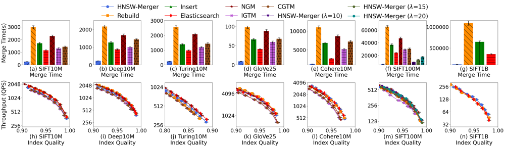
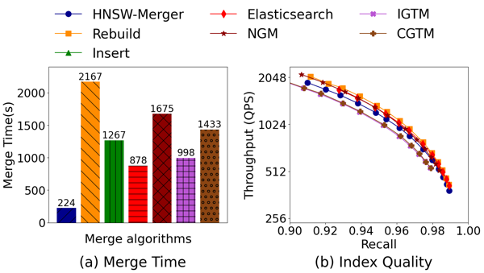
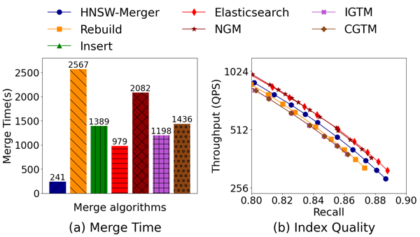
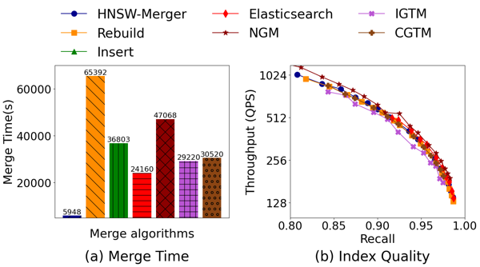
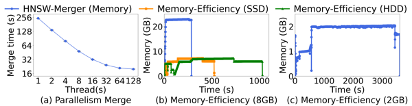
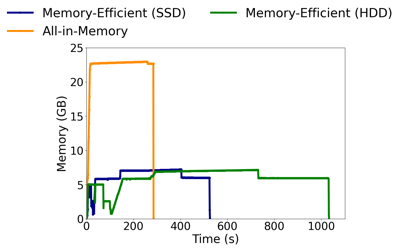
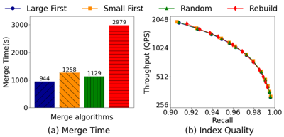
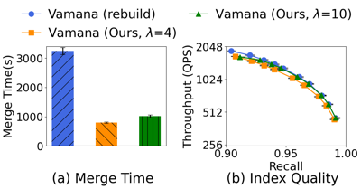
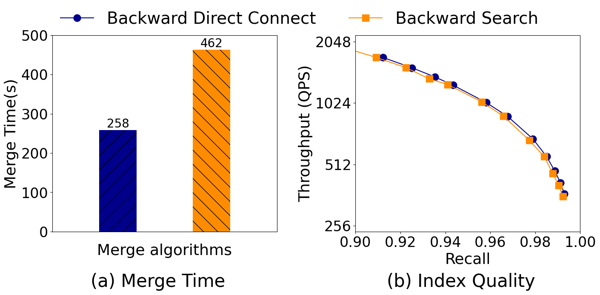
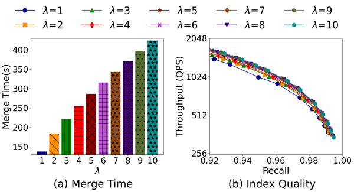

# HNSW-Merger: An Efficient HNSW Index Merging in Vector Databases

Vector databases have become a cornerstone of modern data science and AI applications, powering recommendation systems, semantic search, retrieval-augmented generation, and more. This paper focuses on vector index merging (particularly HNSW merging), which merges two (or more) vector indexes. This is a key operation in vector databases with many use cases in vector index construction and vector index updates. While there are a few early approaches to solve the problem, the index merging performance remains slow. In this work, we propose HNSW-Merger, a new algorithm for merging two (or more) HNSW indexes that fully exploits the proximity information in existing indexes. It is a novel two-stage, search-based algorithm that relies on forward HNSW search and lazy backward direct-connect to efficiently connect potential edges. HNSW-Merger is optimized for multi-core parallelism and memory efficiency. It also supports efficient merging of multiple indexes. Extensive experiments show that HNSW-Merger achieves significantly faster merging performance (up to 11.6x) than prior approaches while maintaining similar or even higher index quality.

<!-- TOC -->

## 1. Repository Overview

### 1.1 hnswlib

This codebase is modified based on the [hnswlib](https://github.com/nmslib/hnswlib) library, and add multiple functions to merge HNSW indexes based on our algorithm or other baselines.

### 1.2 Baselines

We implememt several baselines for comparison, including:

- rebuild approach
- insert-based approach
- Elasticsearch approach: reimplemented from [JLucene](/lucene/lucene/core/src/java/org/apache/lucene/util/hnsw) and Elasticsearch [post](https://www.elastic.co/search-labs/blog/hnsw-graphs-speed-up-merging)
- NGM, IGTM and CGTM: reimplemented from [codebase](https://github.com/aponom84/merging-navigable-graphs) and [paper](https://arxiv.org/abs/2505.16064)

### 1.3 HNSW-Merger structure

We explain every updates in our HNSW-Merger:

```
./
├── baseline2.h               // reimplementation of NGM, IGTM and CGTM
├── baseline.h                // reimplementation of Elasticsearch approach
├── bruteforce.h  
├── build_index.cpp           // script for index construction
├── experiment.cpp            // script for index merge experiments
├── extension.h               // implementation of our algorithm
├── hnswalg.h
├── hnswlib.h                 // simple modification for merge strategy
├── io_stats.hpp              // tool to calculate read/write volumn
├── Makefile                  // script of compiling execution program
├── memory-optimize-2G.h      // implementation of our memory-efficient design (2GB limit version)
├── memory-optimize.h         // implementation of our memory-efficient design
├── run_and_log_mem.sh        // script of memory comsumption monitor
├── space_ip.h
├── space_l2.h
├── stop_condition.h
├── test_config.h             // experiment shell design and decode
├── test_readfile.h           // fvecs/ivecs/bvecs file read
├── VarArray.h                // vector data storage structure in memory-efficient design
└── visited_list_pool.h
```

<!-- To be noticed, our beam search function in `extension.h` is used for Elasticsearch, IGTM and CGTM.  -->

<!-- ### 0.3 Specific in Beam Search -->

<!-- As we know, beam search can get a better index quality (on the same query per second level, index built by beam search can return more accurate results than the index built by the point search, which the original hnswlib implements), but a bad search cost because of too many candidates during search. 

Our design as well as To make a fair comparison under the hnswlib framework, we limit the performance of beam search used in the merge algorithms. 
We first choose the `lowerBound` to be the bandWidth-th nearest distance of the top distance, but still choose  `efc` neighbors during search operation in insert operation. This achieves a great balance between the lots of candidates during beam search and its high beam search latency. We validate our design to match the feature of Elasticsearch's [post](https://www.elastic.co/search-labs/blog/hnsw-graphs-speed-up-merging#experiment-1:-int8-quantization).

The Elasticsearch approach with our beam search compared with the original hnswlib insert approach can match the experiment in the Elasticsearch's post. Their results are: compared to the insert-based approach (baseline), merge has a 1.72x speed up but has a compariable index quality. Our experiment in SIFT10M and DEEP10M fit this result. (Turing is a specific case and all the merge algorithms have a better index quality than rebuild/insert approach.) -->

## 2. Prerequisite

### 2.1 Download datasets

<!-- We support running any dataset with a readable file type by `test_readfile.h`, and the dataset configuration should be added into `test_config.h` before any dataset except `SIFT`, `DEEP` and `TURING` are waiting for experiments. -->

Datasets can be downloaded from the following link: 
  - [SIFT](http://corpus-texmex.irisa.fr/)
  - [DEEP](https://github.com/matsui528/deep1b_gt/tree/master)
  - [TURING](https://github.com/harsha-simhadri/big-ann-benchmarks/tree/main/neurips23)
  - [GloVe25](https://nlp.stanford.edu/projects/glove/)
  - [Cohere](https://github.com/zilliztech/VectorDBBench?tab=readme-ov-file)

### 2.2 Dependencies

OpenMP 4.5

## 3. Experiment Setup

All of the following steps should be processed in the folder `./HNSW-Merger`. After downloading the codebase, run the following commands to enter the folder:

```
git clone [repository link] or download the zip file
cd [repository folder]
cd ./HNSW-Merger
```

### 3.1 How to Build a Index

There are several configuration parameters can be set in the script:

```
dim             = [dimention of dataset]
max_elements    = [maximum number of points in the index]
nb              = [number of points in the dataset]
M               = [index configuration]
ef_construction = [index configuration]
lrange          = [left range of point id you want to insert into index from dataset]
rrange          = [right range of point id you want to insert into index from dataset]

base_filepath   = [dataset file path]
index_path      = [index save file path]
```

We give an example in `./scripts/config_build_test`, which is used for building index on SIFT10M dataset. 

Run the following command to build index based on the dataset and script:

```
export OPENBLAS_NUM_THREADS = [number of thread, optional]
export GOTO_NUM_THREADS = [number of thread, optional]
export OMP_DYNAMIC = [true or false, optional]
export OMP_NUM_THREADS = [number of thread, optional]
make build
./builds [build script path]
```

### 3.2 How to Merge indexes

There are several configuration parameters can be set in the script:

```
workload_type         = [workload type]
merge_method          = [merge method type]
multi_test_method     = [only for multiple index merge experiment, merge type]
dim                   = [dimention of dataset for the index]
max_elements          = [maximum number of points in the index]
nb                    = [number of points in the dataset]
M                     = [index configuration]
ef_construction       = [index configuration]
k                     = [top-k result in the index quality test]
kk                    = [top-kk result list in the groundtruth file]
nq                    = [number of query in query file]
iterations            = [number of iterations the merge operation runs]
lrange                = [only for insert merge experiment, left range of inserted point id]
rrange                = [only for insert merge experiment, right range of inserted point id]
rerun                 = [true for rerun the merge operation, false for load the saved index for query test]
thread                = [only for rebuild or insert merge experiment, number of threads]
lambda                = [only for HNSW-Merger]
save_index            = [true for save index to indicated path, or false]

base_filepath         = [dataset file path]
query_filepath        = [query set file path]
groundtruth_filepath  = [ground truth set file path]
index_path            = [all index paths that need to be merged, separated by commas]
save_path             = [the saved folder for merged index]
efs_array             = [for query test, all tested efs during search, separated by commas]
```

<!-- For the first three parameters, you can find the enumerated type in `test_config.h`, which is also editable. -->

Note that not all the configuration parameters are required for every type of experiments. For example, for all experiments except `MULTI_TWO_MERGE`, it is no need to set the `multi_test_method`.

We give an example in `./scripts/config_merge_test`, which is used for merging indexes on two 5M-indexes. 

Run the following command to merge indexes based on the script you prepared:

```
export OPENBLAS_NUM_THREADS = [number of thread, optional]
export GOTO_NUM_THREADS = [number of thread, optional]
export OMP_DYNAMIC = [true or false, optional]
export OMP_NUM_THREADS = [number of thread, optional]
make exp
./exps [merge script path]
```

## 4. Experiment Overview

<!-- ### 4.1 Comparison between different merge algorithms on different datasets -->

<!-- Summary: As for all the experiments, our HNSW-Merger algorithm outperforms all the baselines in terms of merge speed, and achieve compariable index quality with the best baseline in each experiment.  -->

#### Comparing on Different Dataset



<!-- #### DEEP10M -->

<!--  -->

<!-- #### TURING10M -->

<!--  -->

<!-- #### SIFT100M -->

<!--  -->

<!-- ### 4.2 Different design choice comparison -->

#### Parallelism and Memory-Efficiency Design



<!-- #### Memory-Efficient Design

 -->

#### Multiple Index Merge Srategies



#### Extending to Vamana Graph



<!-- #### Backward Direct Connect vs Backward Search -->

<!--  -->

<!-- #### Different $\lambda$ -->

<!--  -->

## 5. Conclusion

In this work, we introduce HNSW-Merger, an out-of-place, two-stage algorithm for merging HNSW indexes that combines a lightweight forward search with a lazy backward direct connect mechanism, achieving significant speedup over prior approaches while maintaining comparable or higher index quality. 
Building on this core, we developed a parallel merging strategy and a memory-efficient design to improve performance and reduce resources. We also extended our method to multi-index scenario.